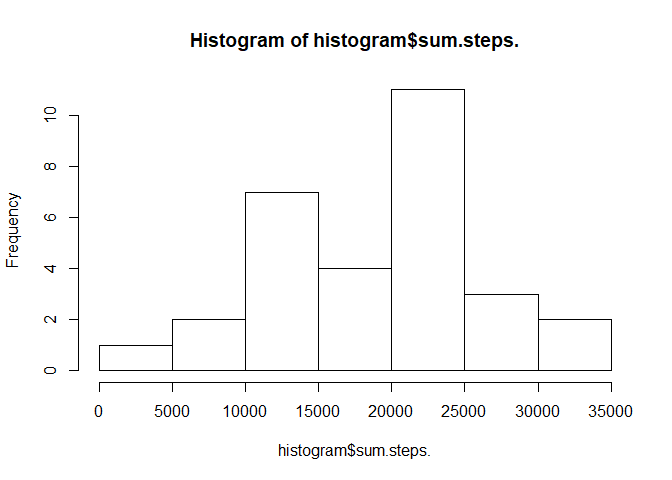

```r
library(lubridate)
```

```
## 
## Attaching package: 'lubridate'
```

```
## The following object is masked from 'package:base':
## 
##     date
```

```r
library(dplyr)
```

```
## Warning: package 'dplyr' was built under R version 3.5.3
```

```
## 
## Attaching package: 'dplyr'
```

```
## The following objects are masked from 'package:lubridate':
## 
##     intersect, setdiff, union
```

```
## The following objects are masked from 'package:stats':
## 
##     filter, lag
```

```
## The following objects are masked from 'package:base':
## 
##     intersect, setdiff, setequal, union
```

```r
library(ggplot2)
```

```
## Warning: package 'ggplot2' was built under R version 3.5.3
```

```r
activity = read.csv('activity.csv')
```

##Calculate the total number of steps taken per day

##Calculate and report the mean and median of the total number of steps taken per day


```r
activity = na.omit(activity)
activity$date = as.Date(activity$date)

activity$day = format(activity$date , "%d")


activity %>% group_by(day) %>% summarize(sum(steps))
```

```
## # A tibble: 30 x 2
##    day   `sum(steps)`
##    <chr>        <int>
##  1 02           10726
##  2 03           21923
##  3 04           12116
##  4 05           23733
##  5 06           23754
##  6 07           23898
##  7 08            3219
##  8 09           12811
##  9 10            9900
## 10 11           22912
## # ... with 20 more rows
```

```r
activity %>% group_by(day) %>% summarize(mean(steps))
```

```
## # A tibble: 30 x 2
##    day   `mean(steps)`
##    <chr>         <dbl>
##  1 02             18.6
##  2 03             38.1
##  3 04             42.1
##  4 05             41.2
##  5 06             41.2
##  6 07             41.5
##  7 08             11.2
##  8 09             44.5
##  9 10             34.4
## 10 11             39.8
## # ... with 20 more rows
```

```r
activity %>% group_by(day) %>% summarize(median(steps))
```

```
## # A tibble: 30 x 2
##    day   `median(steps)`
##    <chr>           <dbl>
##  1 02                  0
##  2 03                  0
##  3 04                  0
##  4 05                  0
##  5 06                  0
##  6 07                  0
##  7 08                  0
##  8 09                  0
##  9 10                  0
## 10 11                  0
## # ... with 20 more rows
```

```r
histogram = data.frame(activity %>% group_by(day) %>% summarize(sum(steps)))

hist(histogram$sum.steps.)
```

<!-- -->

```r
barplot(height = histogram$sum.steps.,names.arg = histogram$day)
```

<!-- -->

##Make a time series plot (i.e. \color{red}{\verb|type = "l"|}type = "l") of the 5-minute interval (x-axis) and the average number of steps taken, averaged across all days (y-axis)

##Which 5-minute interval, on average across all the days in the dataset, contains the maximum number of steps?


```r
part2 = activity %>% group_by(interval) %>% summarize(mean(steps))

plot(x = part2$interval,y = part2$`mean(steps)`,type = 'l')
```

<!-- -->

```r
row = which((part2$`mean(steps)`)==max(part2$`mean(steps)`))

part2[row,]
```

```
## # A tibble: 1 x 2
##   interval `mean(steps)`
##      <int>         <dbl>
## 1      835          206.
```

## Calculate and report the total number of missing values in the dataset (i.e. the total number of rows with NA's


```r
activity = read.csv('activity.csv')

na_count = function(a)
{
  sum(is.na(a))
}

sum(apply(activity,MARGIN = 1,na_count))
```

```
## [1] 2304
```


##Devise a strategy for filling in all of the missing values in the dataset. The strategy does not need to be sophisticated. For example, you could use the mean/median for that day, or the mean for that 5-minute interval, etc.


```r
for(i in 1:ncol(activity)){
  activity[is.na(activity[,i]), i] <- mean(activity[,i], na.rm = TRUE)
}
```

```
## Warning in mean.default(activity[, i], na.rm = TRUE): argument is not
## numeric or logical: returning NA
```

```r
sum(apply(activity,MARGIN = 1,na_count))
```

```
## [1] 0
```

##Make a histogram of the total number of steps taken each day and Calculate and report the mean and median total number of steps taken per day. Do these values differ from the estimates from the first part of the assignment? What is the impact of imputing missing data on the estimates of the total daily number of steps?


```r
activity$date = as.Date(activity$date)

activity$day = format(activity$date , "%d")


activity %>% group_by(day) %>% summarize(sum(steps))
```

```
## # A tibble: 31 x 2
##    day   `sum(steps)`
##    <chr>        <dbl>
##  1 01          21532.
##  2 02          10726 
##  3 03          21923 
##  4 04          22882.
##  5 05          23733 
##  6 06          23754 
##  7 07          23898 
##  8 08          13985.
##  9 09          23577.
## 10 10          20666.
## # ... with 21 more rows
```

```r
activity %>% group_by(day) %>% summarize(mean(steps))
```

```
## # A tibble: 31 x 2
##    day   `mean(steps)`
##    <chr>         <dbl>
##  1 01             37.4
##  2 02             18.6
##  3 03             38.1
##  4 04             39.7
##  5 05             41.2
##  6 06             41.2
##  7 07             41.5
##  8 08             24.3
##  9 09             40.9
## 10 10             35.9
## # ... with 21 more rows
```

```r
activity %>% group_by(day) %>% summarize(median(steps))
```

```
## # A tibble: 31 x 2
##    day   `median(steps)`
##    <chr>           <dbl>
##  1 01               37.4
##  2 02                0  
##  3 03                0  
##  4 04               37.4
##  5 05                0  
##  6 06                0  
##  7 07                0  
##  8 08               37.4
##  9 09               37.4
## 10 10               37.4
## # ... with 21 more rows
```

```r
histogram2 = data.frame(activity %>% group_by(day) %>% summarize(sum(steps)))

hist(histogram2$sum.steps.)
```

<!-- -->

```r
barplot(height = histogram2$sum.steps.,names.arg = histogram2$day)
```

<!-- -->


```r
activity$weekday = wday(activity$date, label=TRUE)

weekend_flag <- function(x)
{
  a = as.character(x)
  if(x=='Sat' | x=='Sun')
    return(0)
  else
    return(1)
    
}


activity$flag = as.factor(sapply(activity$weekday, weekend_flag))

part6 = activity %>% group_by(flag,interval) %>% summarize(mean(steps))

qplot(x = part6$interval,y = part6$`mean(steps)`,col = part6$flag) + geom_line()
```

<!-- -->

